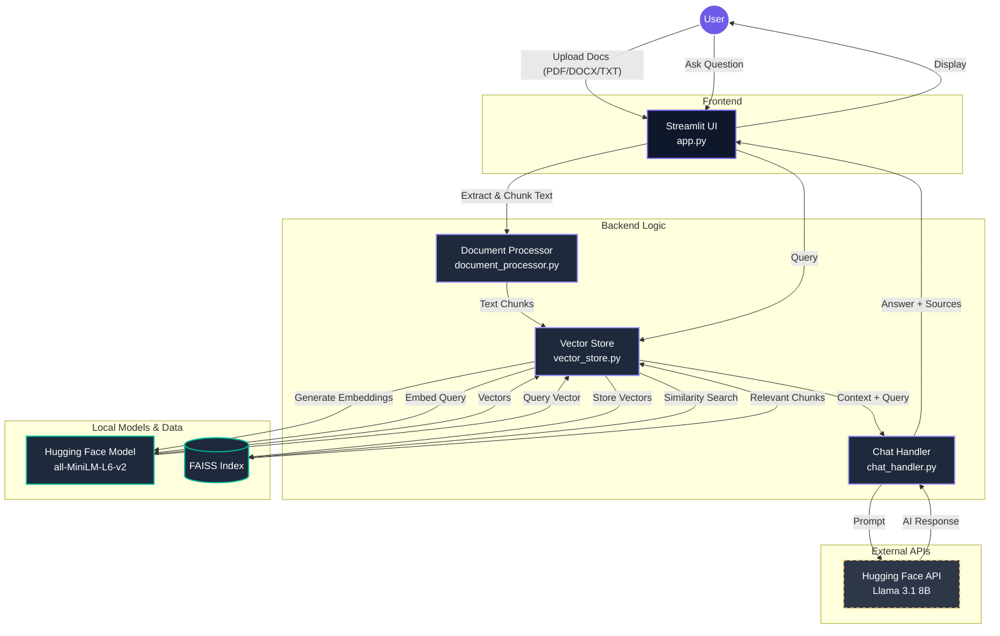

# Modern Generative AI Document Processing Chatbot

🤖 **Powered by Llama 3.1 & FAISS Vector Search**

A modern, production-ready document processing chatbot that allows users to upload documents and have intelligent conversations about their content using Meta's Llama 3.1 model via the Hugging Face Inference API.

## ✨ Features

- **Multi-format Support**: PDF, DOCX, and TXT files
- **Intelligent Search**: FAISS vector database with local Hugging Face embeddings (`all-MiniLM-L6-v2`)
- **Context-aware Responses**: Powered by Llama 3.1 8B Instruct
- **Real-time Chat**: Interactive web interface with source attribution
- **Smart Analytics**: Document processing statistics and chat metrics
- **Suggested Questions**: AI-generated relevant questions
- **Premium UI**: Highly polished, modern interface with a rich Dark Blue default theme and seamless Dark Mode support

## 🚀 Quick Start

### Prerequisites

- Python 3.8+
- Hugging Face API Token
- Git

### Installation

1. **Clone the repository**
   ```bash
   git clone https://github.com/lasithadilshan/document-chatbot
   cd document-chatbot
   ```

2. **Create virtual environment**
   ```bash
   python -m venv venv
   
   # Activate virtual environment
   # Windows:
   venv\Scripts\activate
   # macOS/Linux:
   source venv/bin/activate
   ```

3. **Install dependencies**
   ```bash
   pip install -r requirements.txt
   ```

4. **Set up environment variables**
   
   Create a `.env` file in the project root:
   ```env
   HUGGINGFACE_API_KEY=your_hf_token_here
   ```
   
   Get your token from [Hugging Face](https://huggingface.co/settings/tokens)

5. **Run the application**
   
   For optimal stability, especially on macOS, use the provided launch script which safely configures threading:
   ```bash
   chmod +x run.sh
   ./run.sh
   ```

6. **Open your browser**
   
   Navigate to `http://localhost:8501`

## 📁 Project Structure

```
document-chatbot/
├── app.py                 # Main Streamlit application
├── document_processor.py  # Document parsing utilities
├── vector_store.py        # FAISS vector store with HF embeddings
├── chat_handler.py        # Hugging Face Inference API interaction
├── requirements.txt       # Dependencies
├── .env                   # Environment variables (create this)
├── .gitignore             # Git ignore rules
└── ReadMe.md              # ReadMe file
```

## 🛠️ Core Components

### Document Processor (`document_processor.py`)
- Extracts text from PDF, DOCX, and TXT files
- Smart text chunking with overlap
- Robust error handling and text cleaning

### Vector Store (`vector_store.py`)
- FAISS-based similarity search
- Local `sentence-transformers` (`all-MiniLM-L6-v2`) for fast, cost-free embeddings
- Thread-safe singleton implementation to prevent macOS `fork()` crashes
- Persistent storage and retrieval
- Batch processing for efficiency

### Chat Handler (`chat_handler.py`)
- Llama 3.1 8B Instruct / Zephyr integration via Hugging Face Inference API
- Context-aware response generation
- Optimized prompt engineering

### Main Application (`app.py`)
- Streamlit web interface
- Session state management
- Real-time chat functionality
- Analytics and suggested questions

## 📋 Dependencies

```
streamlit==1.39.0
huggingface_hub
faiss-cpu==1.8.0
PyPDF2==3.0.1
python-docx==1.1.2
numpy==1.26.4
python-dotenv==1.0.1
sentence-transformers==3.0.1
torch==2.3.1
```

## 🎯 Usage Examples

### Effective Questions for Document Q&A

**Specific Information Retrieval:**
- "What are the main findings in this report?"
- "Can you extract all the dates and deadlines mentioned?"
- "What statistics or numbers are provided about [specific topic]?"

**Analysis and Comparison:**
- "Compare the advantages and disadvantages discussed"
- "What are the main differences between [concept A] and [concept B]?"
- "How does this document support or contradict [specific claim]?"

**Summary and Synthesis:**
- "Provide a bullet-point summary of the main topics"
- "What are the key recommendations or action items?"
- "Explain the main argument or thesis of this document"

## 🔧 Configuration

### Environment Variables

| Variable | Description | Required |
|----------|-------------|----------|
| `HUGGINGFACE_API_KEY` | Your Hugging Face API Token | Yes |

### Model Settings

The application uses optimized settings for Llama 3.1:
- **Temperature**: 0.1 (focused responses)
- **Top-p**: 0.8
- **Max tokens**: 1024

## 📊 Features Overview

### Document Processing
- ✅ Multi-file upload support
- ✅ Automatic text extraction and cleaning
- ✅ Smart chunking with configurable overlap
- ✅ Progress tracking and error handling

### Vector Search
- ✅ FAISS similarity search
- ✅ Local `sentence-transformers` embeddings (384 dimensions)
- ✅ Relevance scoring
- ✅ Source attribution

### Chat Interface
- ✅ Real-time conversation
- ✅ Context-aware responses
- ✅ Source citation and expandable references
- ✅ Chat history persistence

### Analytics & Insights
- ✅ Document processing statistics
- ✅ Chat metrics and usage tracking
- ✅ AI-generated suggested questions
- ✅ Performance monitoring

## 🚀 Advanced Features

### Suggested Questions
The application automatically generates relevant questions based on your document content using Llama's understanding of the material.

### Source Attribution
Every response includes expandable source references showing:
- Relevance scores
- Source document names
- Specific text excerpts used

### Smart Chunking
Documents are intelligently split while preserving:
- Sentence boundaries
- Paragraph structure
- Context continuity

## 🛡️ Error Handling

The application includes comprehensive error handling for:
- Invalid file formats
- Corrupted documents
- API rate limits
- Network connectivity issues
- Memory constraints

## 🔍 Troubleshooting

### Common Issues

**API Key Problems:**
Ensure your `HUGGINGFACE_API_KEY` is correctly set in the `.env` file and that it has permissions to query models via the Inference API.

**Memory Issues with Large Documents:**
- Reduce chunk_size to 500-800 characters
- Process documents in smaller batches
- Clear vector store between different document sets

**Slow Performance:**
- Use smaller embedding batches
- Limit search results (reduce k parameter)
- Consider FAISS with GPU support for large datasets

**File Processing Errors:**
- Ensure files are not corrupted
- Check file permissions
- Try processing one file at a time

## 🚀 Deployment

### Local Development
For optimal stability on all platforms (specifically mitigating `fork()` restrictions on macOS), run:
```bash
./run.sh
```

### Production Deployment

**Docker (Recommended):**
```dockerfile
FROM python:3.9-slim
WORKDIR /app
COPY requirements.txt .
RUN pip install -r requirements.txt
COPY . .
EXPOSE 8501
CMD ["./run.sh"]
```

## 🔄 Future Enhancements

### Immediate Improvements
- [ ] Add Excel and PowerPoint support
- [ ] Implement semantic chunking
- [ ] Add vector store persistence
- [x] Enhanced UI with dark blue aesthetic and native dark mode

### Advanced Features
- [ ] Multi-language support
- [ ] Document comparison tools
- [ ] Export functionality
- [ ] User authentication

### Production Features
- [ ] Docker containerization
- [ ] Cloud deployment templates
- [ ] API endpoints
- [ ] User analytics

## 🤝 Contributing

1. Fork the repository
2. Create a feature branch (`git checkout -b feature/amazing-feature`)
3. Commit your changes (`git commit -m 'Add amazing feature'`)
4. Push to the branch (`git push origin feature/amazing-feature`)
5. Open a Pull Request

## 📄 License

This project is licensed under the MIT License - see the [LICENSE](LICENSE) file for details.

## 🙏 Acknowledgments

- **Meta & Hugging Face** for the Llama 3.1 model and Inference API
- **Facebook AI Research** for FAISS vector search
- **Streamlit Team** for the excellent web framework
- **Open Source Community** for the supporting libraries

## 📞 Support

- **Documentation**: Check this README and inline code comments
- **Email**: dilshantilakaratne29@gmail.com

## 🌟 Show Your Support

If this project helped you, please give it a ⭐ on GitHub!

---

**Built with ❤️ using modern AI technologies**

*Last updated: June 2026*

## Architecture Diagram


